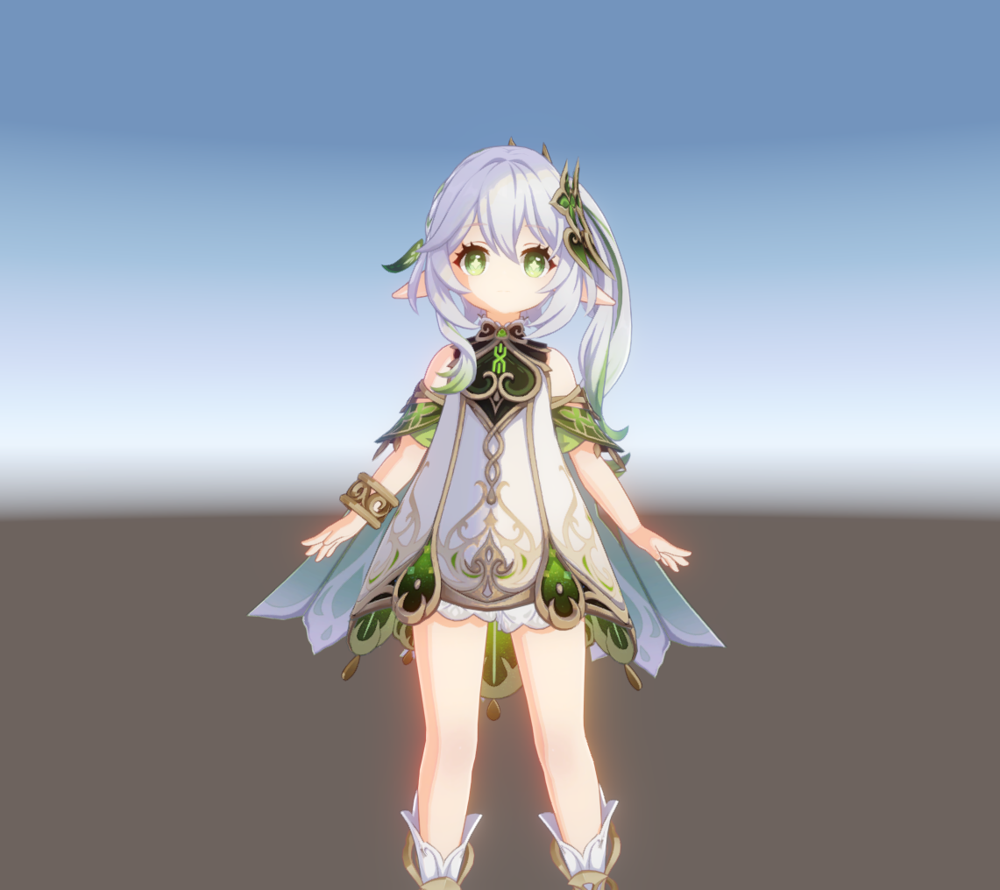

# NahidaRender (Godot 版)

在 Godot 4.7 中一比一复刻原神卡通渲染效果（纳西妲）。渲染核心逐行移植自 Unity URP
工程 [NahidaRenderProject](https://github.com/kaze-mio/NahidaRenderProject) 的
`URPGenshinToon` 着色器与 `URPGenshinPostProcess` 后处理链。

## 鸣谢

本项目特别感谢 **[kaze-mio/NahidaRenderProject](https://github.com/kaze-mio/NahidaRenderProject)**：
全部渲染算法（卡通着色、脸部 SDF 阴影、描边、后处理）、材质参数与角色资源均以该
Unity 工程为蓝本，本仓库只是它在 Godot 引擎上的逐行移植/学习性复刻。其上游参考：

- [UnityGenshinToonShader](https://github.com/kaze-mio/UnityGenshinToonShader)
- [UnityGenshinPostProcessing](https://github.com/kaze-mio/UnityGenshinPostProcessing)

## 声明

角色模型与贴图为游戏提取资源，**仅限学习用途，禁止商用**。本项目与原神官方无关。

## 运行

用 Godot **4.7**（.NET/Mono 版或标准版均可）打开本目录，直接运行主场景
`scenes/main.tscn`。鼠标点击画面锁定视角：**WASD** 移动、**Q/E** 升降、
**Esc** 释放鼠标。

编辑器预览：直接旋转场景中的 DirectionalLight3D 节点，卡通光照（含脸部 SDF
阴影）会实时跟随，无需运行游戏。

## 目录结构

| 路径 | 内容 |
| --- | --- |
| `shaders/toon_common.gdshaderinc` | 卡通着色核心（移植 `ToonForwardPass.hlsl` 的 `ComputeToonShading`） |
| `shaders/toon.gdshader` / `toon_doublesided.gdshader` | 前向着色（单面 / 双面裙摆） |
| `shaders/outline.gdshader` | 反转外壳描边（移植 `ToonOutlinePass.hlsl`，支持 CUSTOM0 平滑法线） |
| `shaders/brow_showthrough.gdshader` | 眉毛透发叠加（移植 `ToonBrowShowThroughPass.hlsl`） |
| `shaders/gradient_sky.gdshader` | 仿 Unity 默认天空盒渐变背景 |
| `shaders/post/*.glsl` + `scripts/genshin_post_effect.gd` | CompositorEffect 后处理链（逐 pass 移植 Unity `URPGenshinPostProcess`） |
| `materials/` | 对齐 Unity `Nahida_Base.mat` 及其变体的 ShaderMaterial（含描边 next_pass） |
| `scenes/nahida.tscn` | 纳西妲模型实例 + 材质覆盖 + 脸部朝向更新脚本 |
| `scenes/main.tscn` | 主场景：相机 / 平行光 / 天空 / 泛光后处理 |
| `scripts/main_light.gd` | 每帧把主光方向写入全局 uniform `main_light_direction`（可绕 Y 旋转；编辑器里旋转 DirectionalLight3D 节点即实时预览） |
| `scripts/face_direction_updater.gd` | 对应 Unity `MaterialUpdater`，从头骨骼写入 `face_direction` |
| `tools/smooth_normal_import.gd` | FBX 导入后处理：生成切线空间平滑法线存入 CUSTOM0（对应 Unity 的 `Nahida_Body_Smooth.mesh` TEXCOORD7） |
| `assets/` | 模型与贴图（来自 Unity 工程，仅学习用途，禁止商用） |

## 与 Unity 版的对应关系

- **阴影**：Lightmap G 通道 × 顶点色 R 作为 AO，Half-Lambert 阶梯阴影 + ShadowRamp
  分档采样（材质 ID 来自 Lightmap A 通道，`_UseCustomMaterialType` 时取自定义值）。
- **脸部 SDF 阴影**：`face_light_map` + `face_shadow_tex`，光照方向绕 Y 扫掠。
  公式与 Unity 一致，唯 SDF 翻面条件须反号（见下文坐标约定差异），
  已用侧光参考图逐像素验证左右方向。
- **高光**：Blinn-Phong + MetalMap matcap（非金属 / 金属按 Lightmap R 切换，
  MetalMap 为 sRGB 贴图 `Avatar_Tex_MetalMap.png`）。
- **自发光**：`albedo × emission_intensity × base_map.a`。
- **描边**：视图空间沿法线 XY 挤出，宽度随距离插值（`_OutlineWidthParams`），
  顶点色 A 控制宽度系数，按 Lightmap A 选 5 档描边色；平滑法线在导入时写入
  `CUSTOM0`（RGBA8）。
- **边缘光**：独立 next_pass（`shaders/rim.gdshader`），采样场景深度图做
  Unity 同款屏幕深度差检测（基础 pass 保持不透明写入深度，rim pass 透明叠加）。
- **眉毛透发**：Unity 用模板缓冲标记头发，Godot 无模板缓冲，改为叠加 Pass 手动
  比较场景深度：仅在眉毛被 0.2m 内的遮挡物（刘海）挡住时以
  `show_through_alpha × 视角衰减 × 朝向衰减` 混合绘制。
- **双面 UV**：Unity 场景用的 `Nahida_Body_Smooth.mesh` 含第二套 UV（裙摆/披风
  内侧配色区）。已从 Unity 导出（`tools/body_uv2.bin`），导入时按 UV0 匹配注入
  Godot 网格（注意 Unity 的 mesh.uv 相对 FBX 原值翻转了 V，需双向换算）。

## 贴图导入要求（与 Unity `enableMipMap: 0` 对齐）

Unity 对全部角色贴图关闭了 mipmap，否则 256×20 的 ShadowRamp 会在低 mip 下
把多行颜色混成灰色（表现为"阴影颜色发灰"）。本项目 `assets/textures/*.png.import`
统一设置 `mipmaps/generate=false`，着色器采样用 `filter_linear`（无 mip）。
色彩空间：Diffuse/Ramp/MetalMap/背景为 sRGB（`source_color`），
Lightmap/Normal/FaceLightmap/FaceShadow 线性采样。

## Unity 与 Godot 的坐标/纹理约定差异（重要）

- **纹理 V 原点**：Unity 在左下，Godot 在左上。对网格 UV 采样（Diffuse/Lightmap
  等）两边天然一致（Unity 导入时翻转了 mesh.uv 的 V），但**着色器里计算出的 UV**
  （ShadowRamp 的行号、matcap 坐标）必须翻转 V（`uv.y = 1.0 - uv.y`），
  否则 ShadowRamp 会采到镜像行——脸部阴影会变成灰薰衣草色而非暖粉色。
- **法线绕 Y 旋转 180°**：FBX 导入的轴转换使网格顶点法线的 X、Z 均与 Unity
  相反，而骨骼朝向（脸部 SDF 用的 `face_direction`）不受影响。因此身体
  half-lambert 与高光使用 XZ 翻转后的光向 `light_dir_body = (-L.x, L.y, -L.z)`，
  脸部 SDF 路径保持原光向。
- **两边世界互为 X 镜像（反射）**：`dot(F, L)` 在反射下不变，但
  `cross(F, L).y` 变号。脸部 SDF 的贴图翻面条件因此必须与 Unity **反号**
  （`fcrossl = -cross(f, l).y`），否则侧光时脸部阴影左右颠倒——默认顶光下
  差异极小，务必用侧光验证。

## 后处理（逐 pass 复刻）

`scripts/genshin_post_effect.gd`（CompositorEffect + 计算着色器）复刻 Unity
`URPGenshinPostProcess`：Prefilter(阈值 0.7) → 半分辨率四级 9-tap 高斯链
（半径 2，权重 0.1/0.2/0.3/0.4）→ 加权上采样 → `base + bloom×1.5` → 曝光 1.05 →
filmic tonemap `(1.36c+0.047)c / ((0.93c+0.56)c + 0.14)`。环境 Glow 必须关闭
（否则双重泛光），Environment tonemap 保持 Linear。

## 已知差异

1. **背景**：Unity 目标图的蓝白-黄褐渐变是其默认天空盒，`gradient_sky.gdshader`
   按 Unity 批处理参考图经后处理反推拟合（`unity_reference.png` 可用 Unity 工程
   里的 `Assets/Editor/BatchScreenshot.cs` 重新生成）。
2. 极个别区域（如披风内侧个别面片）因两侧网格细分/法线差异存在轻微色调差别。
3. `EffectMesh` / `EyeStar` 两个特效网格与 Unity 场景一样保持隐藏。

## 调试备忘

- 改 `.gdshaderinc` 后若渲染未变，删除 `.godot/shader_cache` 再跑（包含文件的
  修改不一定触发父着色器重编译）。
- 在编辑器/`--headless --import` 中打开过含编译错误的着色器后，Godot 重新序列化
  材质可能丢失 `shader_parameter/*`；随时可用 `python tools/gen_materials.py`
  一键重建全部材质。
